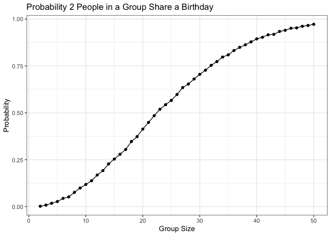
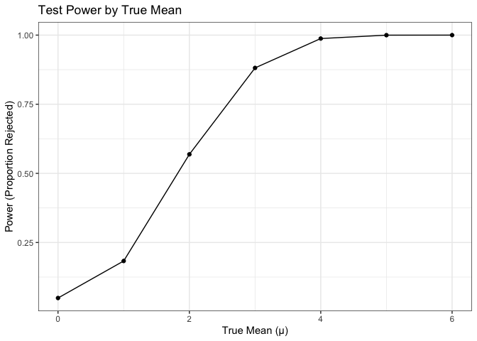
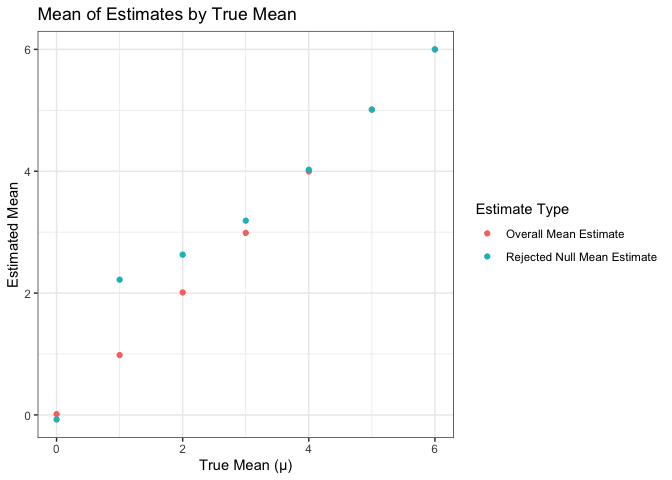
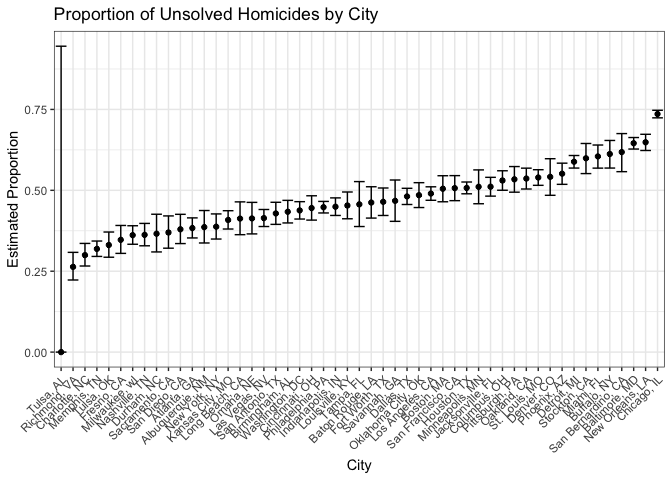

Homework 5
================

``` r
library(tidyverse)
```

# Problem 1

``` r
set.seed(100)
```

``` r
bday_sim = function(n) {
  
  birthdays = sample(1:365, n, replace = TRUE)
  
  repeated_bday = length(unique(birthdays)) < n
  
  return(repeated_bday)
}
```

``` r
bday_sim_results = 
  expand_grid(
    bdays = 2:50,
    iter = 1:10000) |>
  mutate(
    result = map_lgl(bdays, bday_sim)) |>
  group_by(bdays) |>
  summarise(prob_repeat = mean(result))
```

``` r
bday_sim_results |>
  ggplot(aes(x = bdays, y = prob_repeat)) +
  geom_point() +
  geom_line() +
  theme_bw() +
  labs(
    title = "Probability 2 People in a Group Share a Birthday",
    x = "Group Size",
    y = "Probability")
```

<!-- -->

According the simulation performed above, in order to reach a 50%
probability that two people in a group share a birthday, the group size
needed is only about 23 people. At 50 people, the probability is roughly
97%!

# Problem 2

``` r
make_data = function(mu) {
  rnorm(30, mean = mu, sd = 5)
}

run_ttest = function(x) {
  t.test(x, mu = 0)
}

t_test_results = 
  expand_grid(
    mu = 0:6,
    iter = 1:5000) |>
  mutate(
    data = map(mu, make_data),
    t_test = map(data, run_ttest),
    t_test_clean = map(t_test, broom::tidy)) |>
  select(mu, t_test_clean) |>
  unnest(t_test_clean)
```

``` r
t_test_summary = 
  t_test_results |>
  select(mu, estimate, p.value) |>
  group_by(mu) |>
  summarise(
    prop_rejected = sum(p.value <= 0.05) / 5000,
    mean_estimate = mean(estimate),
    rejected_mean_estimate = mean(estimate[p.value <= 0.05]))
```

``` r
t_test_summary |>
  ggplot(aes(x = mu, y = prop_rejected)) +
  geom_point() +
  geom_line() +
  theme_bw() +
  labs(
    title = "Test Power by True Mean",
    x = "True Mean (μ)",
    y = "Power (Proportion Rejected)")
```

<!-- -->

Power increases as the true mean moves further from null hypothesis. In
this case, the the proportion of rejected nulls converges to 1 when the
true mean is greater than 3.

``` r
t_test_summary |>
  pivot_longer(
    cols = mean_estimate:rejected_mean_estimate,
    names_to = "estimate_type",
    values_to = "estimate") |>
  mutate(
    estimate_type = recode(
      estimate_type,
      mean_estimate = "Overall Mean Estimate",
      rejected_mean_estimate = "Rejected Null Mean Estimate")) |>
  ggplot(aes(x = mu, y = estimate, color = estimate_type)) +
  geom_point() +
  theme_bw() +
  labs(
    title = "Mean of Estimates by True Mean",
    x = "True Mean (μ)",
    y = "Estimated Mean",
    color = "Estimate Type")
```

<!-- -->

The average of the estimated means for samples where the null was
rejected is greater than the true mean when the true mean is close to
the null, but becomes similar to the true mean as the difference between
the true mean and the null increases. This occurs because rejected
estimates are usually drawn from the right tail of the null
distribution, since the true mean is above the null, which shifts the
average above the true mean. As power increases, this bias becomes less
pronounced since nearly all estimates are rejected. However, when the
true mean equals the null hypothesis (in this case, μ = 0),
approximately equal numbers of estimates are rejected from the left and
right tails of the distribution, so the average rejected estimate is
close to the true mean.

# Problem 3

``` r
homicide_df = read_csv("data/homicide-data.csv")
```

The data contains 52179 observations. Each observation is a recorded
homicide, with date, location, information about the victim, and the
case disposition.

``` r
# Converting reported_date into datetime object and creating city_state variable
homicide_df = 
  homicide_df |>
  mutate(
    reported_date = ymd(substr(homicide_df$reported_date, 1, 8)),
    city_state = paste(city, state, sep = ", "))
```

``` r
homicide_count_df = 
  homicide_df |>
  group_by(city_state) |>
  summarise(
    total_homicides = n(),
    total_unsolved = 
      sum(disposition %in% c(
        "Closed without arrest", 
        "Open/No arrest")))
```

``` r
Baltimore_MD = 
  homicide_count_df |>
  filter(city_state == "Baltimore, MD")

baltimore_test = 
  prop.test(
  x = Baltimore_MD$total_unsolved,
  n = Baltimore_MD$total_homicides) |>
  broom::tidy() |>
  select(estimate,
         conf.low,
         conf.high)

baltimore_test |>
  knitr::kable(digits = 3)
```

| estimate | conf.low | conf.high |
|---------:|---------:|----------:|
|    0.646 |    0.628 |     0.663 |

Performing the proportion test on Baltimore, MD gives us an estimated
proportion of 0.646 (95% CI: 0.628, 0.663)

Let’s perform the test for all cities!

``` r
city_prop_test = function(df) {
  
  prop.test(x = df$total_unsolved,
            n = df$total_homicides)
}
```

``` r
city_prop_test_df = 
  homicide_count_df |>
  nest(data = -city_state) |>
  mutate(
    prop_test = map(data, city_prop_test),
    results = map(prop_test, broom::tidy)) |>
  select(city_state, results) |>
  unnest(results) |>
  select(city_state,
         estimate,
         conf.low,
         conf.high)
```

``` r
city_prop_test_df |>
  mutate(
    city_state = fct_reorder(city_state, estimate)) |>
  ggplot(aes(x = city_state, y = estimate)) +
  geom_point() +
  geom_errorbar(aes(ymin = conf.low,
                    ymax = conf.high)) +
  theme_bw() +
  theme(axis.text.x = element_text(angle = 45, vjust = 1, hjust = 1)) +
  labs(
    title = "Proportion of Unsolved Homicides by City",
    x = "City",
    y = "Estimated Proportion")
```

<!-- -->

As seen above, Chicago, IL has the highest proportion of unsolved
homicides. While Tulsa, AL is shown as having the lowest, the dataset
only contains one observation for Tulsa, AL, a single solved homicide,
so there isn’t enough data to get an accurate proportion.
